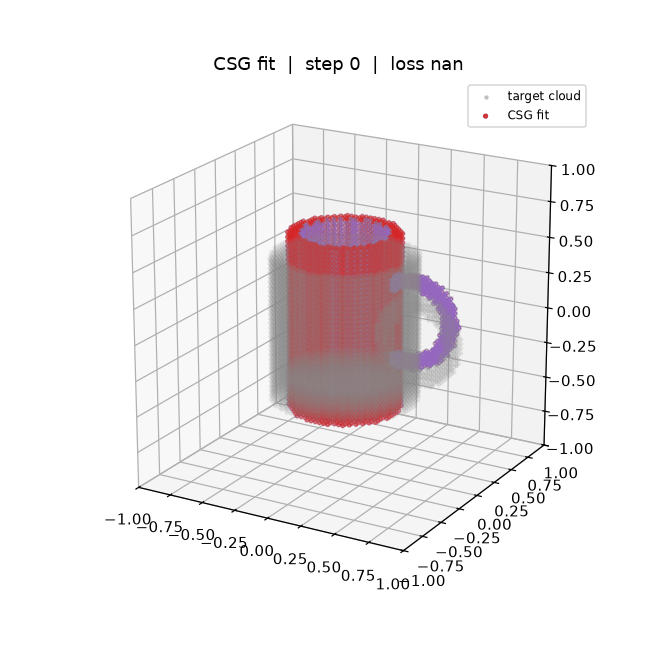

# fitCSG

Fit a **Constructive Solid Geometry (CSG) tree of signed-distance primitives**
to a 3D object, as a compact, interpretable, editable, grasp-aware shape
abstraction (the work behind the *CSGGrasp* submission).

An LLM (or a human) proposes a **hypothesis**: a CSG tree of shapes + boolean
ops **and sensible initial parameters** (center / size / rotation), authored in a
normalised ~unit-cube space. That hypothesis is then **optimised** so its SDF
matches a target derived from an observed object — the parameters refine from a
plausible guess to a tight fit of the specific instance. The starting point is a
meaningful hypothesis, **not** random initialisation.



*Above: the data-free demo. An LLM-style **abstract mug hypothesis**
(`examples/mug_init.json`, colour — taller/thinner, tilted handle) is optimised
until it fits the **actual instance** (`examples/mug.json`, grey point cloud).
This mirrors the intended workflow — start from a plausible hypothesis, not from
random — and the parameters refine to match the specific object.*

> **Status.** This was research code that was buggy and partly faked-to-work; it
> was rebuilt in June 2026 into a clean, *correct* implementation of the idea
> (`fitcsg/` package + tests). It runs CPU-only; a GPU just speeds up fitting.
> The synthetic demo is fully reproducible; the real-data path is implemented
> but untested (no captured data is currently available — see TODOs).

## Pipeline

```
RGB image --(external)--> point cloud --> target SDF  ─┐
                                                       ├─> optimise CSG leaf params  (this repo)
hand-/LLM-authored CSG tree --> predicted SDF  ────────┘
```

This repo owns: **CSG → SDF**, **point cloud → target SDF**, and the
**optimisation loop**. The `RGB → point cloud` front-end and the LLM topology
proposer live outside the repo.

## The idea / intuition

Most everyday objects are well approximated by a few **simple analytic shapes**
combined with boolean operations. Instead of a dense mesh or neural field, we
describe an object as a small **CSG program** — a tree whose leaves are
primitives (cylinder, box, sphere, …) and whose internal nodes are
`union` / `intersection` / `subtraction`. Each primitive has an exact
signed-distance function (SDF), and the boolean ops compose SDFs analytically, so
the whole object has a differentiable SDF we can fit by gradient descent.

This representation is **compact** (a handful of numbers), **interpretable**
(you can read off "a hollow cylinder with a handle"), and **editable** (change a
radius, move a part) — which is exactly what's useful for downstream grasping.

**Worked example — a mug** (`examples/mug.json`, the demo target):

```
union(
    subtraction(              # hollow body:
        cylinder(body),       #   a solid outer cylinder
        cylinder(cavity)      #   minus a slightly smaller inner cylinder -> the cup hole
    ),
    torus(handle)             # plus a torus for the handle
)
```

The art is choosing *which* primitives and ops express an object (the topology),
then letting optimisation dial in the exact parameters. An LLM is well suited to
the first part ("a mug is a hollow cylinder with a ring handle"); optimisation
handles the second.

## How it works (intended workflow)

1. **Hypothesis (LLM).** An LLM proposes a CSG tree — shapes, boolean ops, *and*
   initial parameters — in a normalised ~[-1, 1] unit cube. This is just a JSON
   file; see `examples/mug_init.json`. Good initial params matter: we optimise in
   the normalised space, so a roughly-right guess converges far more reliably.
2. **Observation.** The object's point cloud is normalised to the same scale.
3. **Coarse alignment** *(TODO — not yet implemented)*. The hypothesis and the
   observation have an unknown relative pose; a coarse alignment / pose estimate
   would bring them into rough correspondence. Today this step is skipped and the
   examples are authored already-aligned (`alignment.py` only has a *local*
   similarity-ICP placeholder, which needs a good initial pose).
4. **Target SDF.** Build a target SDF from the (aligned) observation
   (`target.py`); or, with no external data, sample one from a known tree
   (`synthetic.py`).
5. **Optimise (this is the core).** Refine the hypothesis's continuous leaf
   parameters to minimise the SDF loss (`optimize.py`). The **topology is fixed**;
   only the parameters move.
6. **Output.** A fitted CSG tree — compact, interpretable, editable — for
   downstream use (grasping).

The demo GIF above is exactly steps 1→5 with a synthetic instance: start from the
abstract `mug_init.json` hypothesis (already coarsely aligned), optimise onto the
`mug.json` instance.

## Shape primitives

All primitives share `center` (world origin) and `rotation` (XYZ Euler degrees);
the shape-specific params are listed below. Defined in `fitcsg/primitives.py`;
canonical frame is the origin, aligned to local **+Z** where an axis matters.

| shape       | extra params          | good for / notes |
|-------------|-----------------------|------------------|
| `sphere`    | `radius`              | balls, blobs, rounded caps. Exact SDF. |
| `ellipsoid` | `size` (3)            | squashed/elongated spheres (eggs, heads). *Approximate SDF* (no closed form). |
| `box`       | `size` (3)            | cuboids, slabs, frames, table-tops. Exact SDF. |
| `cylinder`  | `radius`, `height`    | cups, cans, tubes, legs, rods. Axis = +Z. Exact SDF. |
| `cone`      | `radius`, `height`    | funnels, tips, tapers (apex at +Z). Exact capped-cone SDF. |
| `torus`     | `radius` (major), `tube` (minor) | handles, rings, rims, donuts. Lies in the XY-plane. Exact SDF. |
| `capsule`   | `radius`, `height`    | rounded rods / limbs / grips (a cylinder with hemispherical caps). Axis = +Z. Exact SDF. |

Combine them with `union` (∪, `min`), `intersection` (∩, `max`) and
`subtraction` (−, carve one out of another) — optionally with a `smooth` blend
radius for soft joins.

### Future primitives to consider

Useful additions for covering more everyday objects (each is a small canonical
SDF + a one-line registry entry in `PRIMITIVES`):

* **rounded box** — boxes with filleted edges (most manufactured objects);
* **capped / partial torus** — a handle arc rather than a full ring;
* **n-gon prism / wedge** — hex bolts, pyramids, ramps, triangular cross-sections;
* **half-space / plane** — slice a shape flat (table cuts, flat bases);
* **rounded cylinder** — cans/bottles with rounded top edges;
* **superquadric / superellipsoid** — one shape that smoothly interpolates
  box↔sphere↔cylinder via 2 exponents (very expressive for organic + manufactured
  parts; a strong candidate if you want fewer leaves per object).

## Onboarding (new here? start with this)

If you've never seen this project before:

1. **Run the demo** (no data, no GPU needed) and watch it fit:
   `python scripts/fit_demo.py --tree examples/mug.json --init_tree examples/mug_init.json --outdir demo_out`
2. **Read in this order:** this README → `fitcsg/csg.py` (what a tree *is*) →
   `fitcsg/primitives.py` (the shapes) → `fitcsg/optimize.py` (the fitting loop)
   → `scripts/fit_demo.py` (how it's all wired together).
3. **Mental model:** a "hypothesis" / "tree" is just a JSON CSG tree (see
   `examples/`). `parse_tree` turns it into objects; `evaluate` gives its SDF;
   `fit` moves its leaf params to match a target SDF.
4. **Common tasks:** author a hypothesis → copy an `examples/*.json` and edit
   params (schema under *Conventions*). Add a new primitive → write a canonical
   SDF and register it in `PRIMITIVES` (`fitcsg/primitives.py`). Implement coarse
   alignment → start from `fitcsg/alignment.py` and the hook in `target.py`.
5. Every module has a top docstring explaining what it does and what's missing;
   `TODO:` comments mark the open roadmap items in-place.

## Layout

```
fitcsg/
  transforms.py   Euler(deg) rotations + world->local transform (one convention everywhere)
  primitives.py   SDF primitives: sphere, ellipsoid, box, cylinder, cone, torus, capsule
  csg.py          tree parse/serialise, CSG ops (+ smooth blends), SDF evaluation, colours
  grid.py         dense grid sampling + surface extraction
  alignment.py    similarity ICP (point-cloud alignment)
  target.py       masked point cloud -> target SDF supervision
  synthetic.py    sample a target SDF from a known tree (no external data)
  optimize.py     fitting loop: truncated-Huber loss, cosine LR, random restarts
  visualize.py    Graphviz tree + matplotlib SDF/fit rendering + GIF assembly
  random_tree.py  random tree generation (smoke tests)
scripts/
  visualize_tree.py   render a tree's graph and/or SDF
  fit.py              fit a tree to a synthetic or real target
  fit_demo.py         animated fit -> GIF (the visual smoke test)
examples/
  sunglasses.json     original hand-authored example (converted to new schema)
  mug.json            demo *instance*: cylinder - cavity + torus handle
  mug_init.json       abstract mug *hypothesis* (LLM-style start for the demo)
tests/                pytest suite (run: pytest)
```

## Installation

```bash
conda env create -f environment.yml
conda activate fitcsg
pip install torch --index-url https://download.pytorch.org/whl/cpu   # or your CUDA build
```

## Quickstart

```bash
# Visualise a tree's SDF (no GPU)
python scripts/visualize_tree.py --tree examples/mug.json --save mug.png

# Self-contained fit: optimise an abstract hypothesis onto a synthetic instance
python scripts/fit.py --tree examples/mug.json --init_tree examples/mug_init.json
# (omit --init_tree to instead randomise params and test recovery, with restarts)
python scripts/fit.py --tree examples/mug.json --restarts 4

# Animated GIF: an abstract mug hypothesis optimised onto the actual instance
python scripts/fit_demo.py --tree examples/mug.json \
    --init_tree examples/mug_init.json --num_steps 500 --outdir demo_out

# Fit to a real observation (needs your own data; see TODOs)
python scripts/fit.py --target files --tree examples/mug.json \
    --pc pointcloud.npy --mask mask.npy

# Tests
pytest
```

## Tests

`pytest` (15 tests) covers the correctness claims above so the next person can
refactor safely:

* `test_transforms.py` — rotation matrices are orthonormal with `det=1`;
  world→local preserves distances.
* `test_primitives.py` — exact sphere/box distances; every primitive encloses a
  non-empty solid and reports far points as outside; box rotation-equivariance;
  size-sign invariance.
* `test_csg.py` — union/intersection/subtraction signs; overlapping-sphere
  volumes; JSON round-trip; legacy-schema loading; colour output shape.
* `test_optimize.py` — the synthetic fit reduces loss by >2× and converges.
* `test_random_tree.py` — random trees parse and yield a non-empty solid.

## Conventions

* **SDF.** Negative = inside, positive = outside. Box/cylinder/sphere/torus/
  capsule are exact; cone is the exact capped-cone formula; the **ellipsoid is
  the standard Inigo-Quilez approximation** (no closed-form SDF exists — it is
  exactly 0 at the centre and accurate near the surface). CSG `min`/`max` give
  the correct sign and zero level set but are not exact distances away from the
  surface (inherent to CSG).
* **Pose.** Every leaf has `center` (world origin) and `rotation` (XYZ Euler
  angles in **degrees**), applied to *all* shapes via one world→local transform.
* **Positivity.** Sizes/radii are passed through `abs()` inside the SDF, so the
  optimiser is unconstrained and cannot invert a shape.
* **JSON schema.** `{"op", "left", "right", "smooth"?}` for internal nodes and
  `{"shape", "name", "params": {...}}` for leaves. Legacy keys
  (`operation`/`type`/`sizes`/`axis`) still load.

## What the rebuild fixed

Brief provenance (the original bugs): rotation was ignored for some primitives
and inconsistent for others; the JSON `rotation` key didn't match the `axis` key
the SDFs read (the shipped example would have crashed); `random_tree_utils.py`
couldn't import; leaf lookup broke for ≥10 instances of a shape; viz colours
were non-deterministic. All fixed, plus a robust loss, restarts, more primitives
(torus/capsule), and a test suite.

## Known limitations & flags

Things to be aware of before relying on this for the resubmission:

* **Coarse alignment is NOT implemented — it's a TODO.** Right now the object's
  canonical pose is *assumed*; the only alignment we do is a **local similarity
  ICP** (`alignment.py`) that lines up scale/rotation/translation between the
  CSG model surface and the observed cloud. It needs a good initial pose and
  diverges under large offsets (verified). A real coarse alignment / pose
  estimator is roadmap item #3 below.
* **Real-data path is untested.** `target.build_target_from_files` is wired up
  for `(pointcloud.npy, mask.npy)` but the original capture data is gone, so it
  has only been exercised on synthetic targets.
* **GPU path unexercised.** Developed/tested CPU-only; `--device cuda` should
  work but hasn't been run here.
* **Approximations.** The ellipsoid SDF and the CSG `min`/`max` are not exact
  distances away from the surface (see Conventions) — fine for fitting, but
  don't treat the field as a metric SDF everywhere.

## Large TODOs & extensions (research roadmap)

These are the substantial pieces left for the resubmission, roughly in order:

1. **Real-world experiments.** Re-establish the `RGB → point cloud` front-end and
   collect/curate objects with hand-authored trees + good initial params. The
   `point cloud → target SDF` half (`target.py`) is ready for
   `(pointcloud.npy, mask.npy)` but is currently untested on real data.
2. **Better fitting loss.** The current loss is a truncated Huber on SDF values.
   Move toward a *best-fit* objective: e.g. bidirectional/Chamfer surface
   distance, Eikonal/normal regularisation, or jointly optimising the alignment
   so the fit matches the observed surface rather than a fixed target SDF.
3. **Drop the canonical-pose assumption.** Today the object's pose is assumed
   and only a local similarity-ICP is solved (`alignment.py`), which needs a
   good init and diverges under large pose offsets. Add real **coarse
   alignment / object-pose estimation** *before* CSG refinement (global
   registration, symmetry handling, or a learned/LLM pose prior).
4. **Cluttered scenes + language grounding.** Identify and segment the target
   object in a cluttered scene, optionally via a **language prompt**, before
   fitting (extension).
5. **Topology from an LLM.** Have an LLM propose the tree topology *and* sensible
   normalised initial parameters (we optimise in a normalised space).
6. **Engineering.** Parallelise restarts (currently sequential), try
   second-order optimisers (LBFGS / Levenberg–Marquardt), and add mesh
   (marching-cubes) export for nicer visuals.

In-code `TODO:` comments mark where each of these hooks in.
